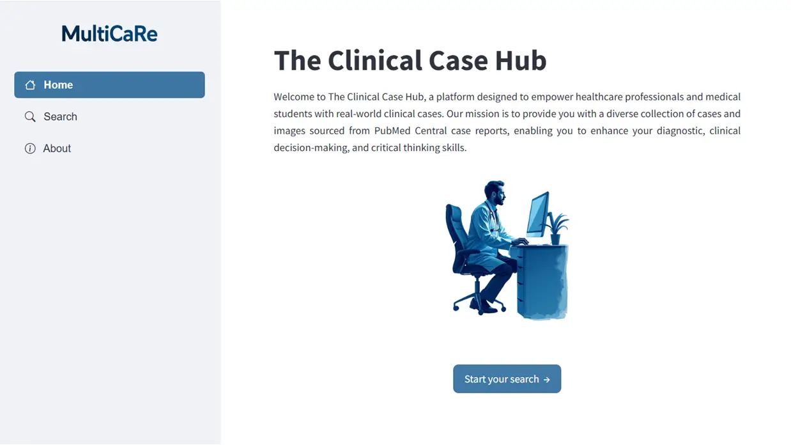
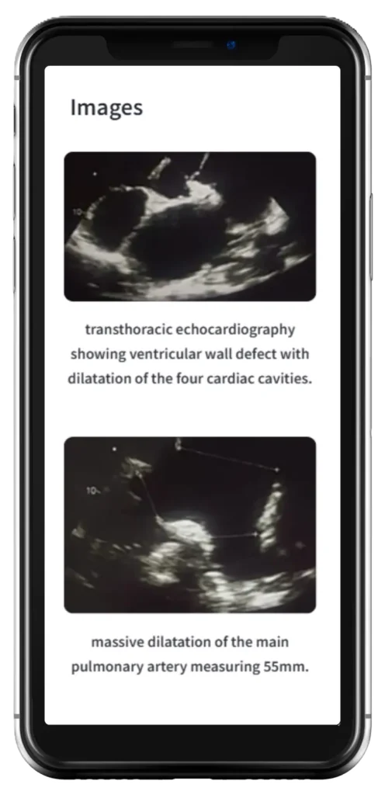
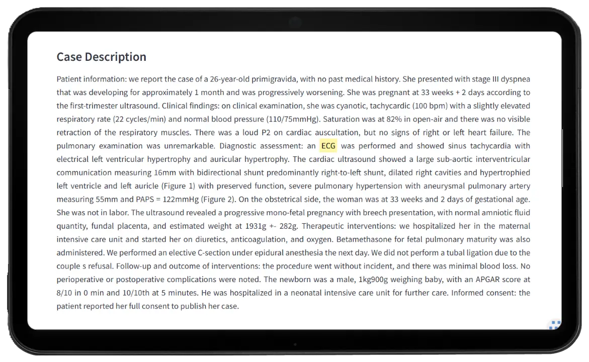
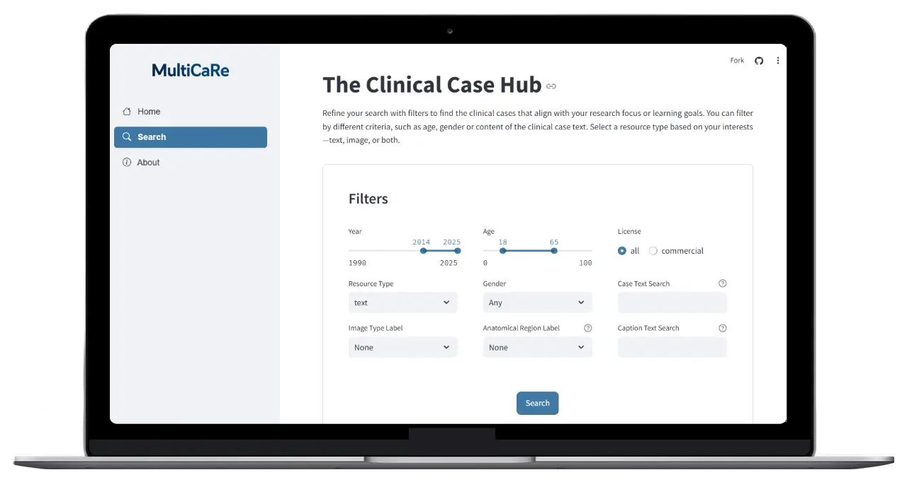

# The Clinical Case Hub

Interactive platform for exploration, filtering, and visualization of real-world clinical case reports and medical images.

---

## Overview

**The Clinical Case Hub** is a Streamlit-based application designed to help healthcare professionals, medical students, and researchers explore clinical case reports extracted from PubMed Central.

The platform enables structured navigation through thousands of clinical cases and medical images using multiple filtering strategies, including demographic filters, image metadata, anatomical regions, free-text search, and logical search operators.

The application is powered by the **MultiCaRe dataset**, a large-scale collection of clinical case reports and medical imaging metadata derived from open-access publications.

---

## Key Features

* Interactive exploration of clinical case reports
* Filtering by age, gender, publication year, and licensing
* Search across case descriptions and image captions
* Support for logical search operators (`AND`, `OR`, `NOT`)
* Medical image filtering by modality and anatomical region
* Visualization of text cases, medical images, or combined results
* Highlighted search term matching within retrieved content
* Responsive Streamlit interface for desktop and mobile devices

---

## Technical Overview

The Clinical Case Hub implements a lightweight clinical information retrieval interface built on top of structured metadata and annotated medical imaging resources.

The application combines:

* Structured filtering pipelines using pandas
* Text parsing and boolean search logic
* Metadata-driven image retrieval
* Interactive clinical case visualization
* Search term highlighting and contextual rendering
* Streamlit-based responsive UI components

The system was designed as an educational and exploratory tool for navigating large collections of real-world clinical case reports and associated medical imaging data.

---

## Dataset

This application is based on the **MultiCaRe dataset**, which contains:

* Clinical case reports extracted from PubMed Central
* Annotated medical image metadata
* Image captions and imaging modality labels
* Anatomical region labels
* Demographic and publication metadata

The dataset includes information derived from:

* More than 72,000 clinical case report articles
* Over 93,000 patients
* Hundreds of thousands of medical images and captions

Useful links:

* MultiCaRe Dataset Repository
  https://github.com/mauro-nievoff/MultiCaRe_Dataset

* Zenodo Dataset Repository
  https://zenodo.org/records/14994046

* MultiCaRe Image Classification Model
  https://huggingface.co/mauro-nievoff/MultiCaReClassifier

---

## Tech Stack

* Python
* Streamlit
* Pandas
* Regular Expressions (Regex)
* Parquet datasets
* Medical imaging metadata
* PubMed Central data sources

---

## Screenshots

### Main Interface


---

### Advanced Clinical Search Interface



---

### Responsive Mobile Visualization



---

### Tablet Visualization



---

### Desktop Presentation



---

## Search Capabilities

The application supports flexible boolean-style queries for clinical case exploration.

Examples:

```text
(CT OR tomography) AND (chest OR thorax) NOT abdomen
```

Supported operators:

* `AND`
* `OR`
* `NOT`

Searches can be applied independently to:

* Clinical case descriptions
* Medical image captions

---

## Repository Structure

```text
clinical-case-hub/
├── assets/
│   └── images/
├── img/
├── team/
├── .github/
├── .streamlit/
├── app.py
├── requirements.txt
├── README.md
└── LICENSE
```

---

## Quick Start

### 1. Clone the repository

```bash
git clone https://github.com/YOUR_USERNAME/clinical-case-hub.git
cd clinical-case-hub
```

### 2. Install dependencies

```bash
pip install -r requirements.txt
```

### 3. Run the application

```bash
streamlit run app.py
```

---

## Disclaimer

This application is intended for research, educational, and exploratory purposes only.

Clinical case reports and medical images are derived from open-access publications and should not be interpreted as medical advice or clinical recommendations for real patients.

Clinical decisions should always rely on qualified healthcare professionals and validated clinical guidelines.

---

## Authors

* María Carolina González Galtier, MD, MA
* Mauro Andrés Nievas Offidani, MD, MSc
* Miguel Massiris
* Facundo Roffet
* Claudio Delrieux, PhD

---

## License

This project is released under the MIT License.
